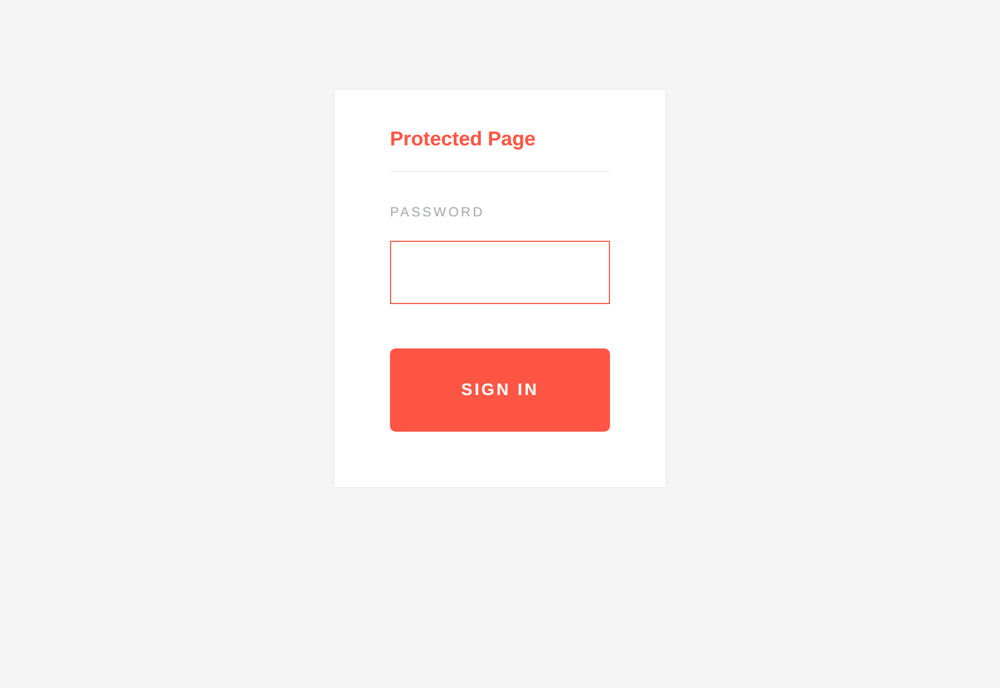
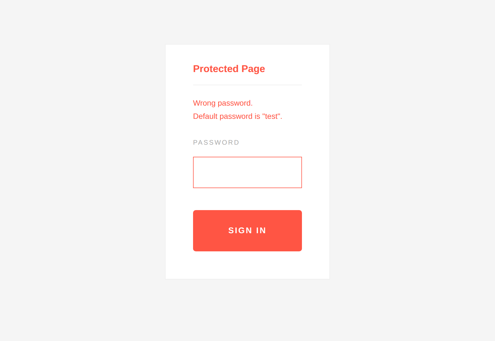
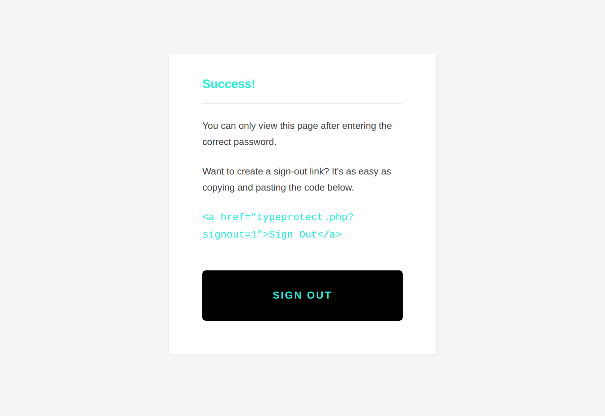

# TypeProtect

Password-protect any PHP page with a single line of code.

```php
<?php require __DIR__ . '/typeprotect.php'; ?>
```

Drop that on the first line of any page and visitors have to sign in before they
can see it. One file, no database, no dependencies.

## Screenshots

| Sign in | Wrong password | Protected page |
| --- | --- | --- |
|  |  |  |

## Why use it

1. Minimal, usable interface: a single clean sign-in screen.
2. Lightweight: one self-contained PHP file, no external CSS or JS.
3. Simple: protect a page with one `require`.

## Requirements

PHP 8.1 or newer.

## Setup

1. Copy **typeprotect.php** into your project.

2. Set your password. Generate a hash and point the script at it. Never store
   the plain password.

   The simplest way, if you have PHP on the command line:

   ```bash
   php -r 'echo password_hash("your-password", PASSWORD_DEFAULT), PHP_EOL;'
   ```

   See [Generating a hash without PHP](#generating-a-hash-without-php) below for
   other options.

   Then either set an environment variable (recommended, keeps secrets out of
   the code):

   ```bash
   export TYPEPROTECT_PASSWORD_HASH='$2y$12$...'
   ```

   Or replace the `$passwordHash` value near the top of `typeprotect.php`.

   The bundled default hashes the password `test`, for the demo only. **Change
   it before deploying anything real.**

3. Protect a page by adding this as its first line:

   ```php
   <?php require __DIR__ . '/typeprotect.php'; ?>
   ```

4. Add a sign-out link anywhere on a protected page:

   ```html
   <a href="typeprotect.php?signout=1">Sign Out</a>
   ```

Optionally set `TYPEPROTECT_SIGNOUT_URL` to control where sign-out redirects
(defaults back to the current page).

## Generating a hash without PHP

TypeProtect verifies passwords with PHP's `password_verify()`, which accepts
**bcrypt** hashes (they start with `$2y$`, `$2a$`, or `$2b$`) and Argon2 hashes.
Any tool below produces a compatible bcrypt hash. The cost factor `12` is a
reasonable default; higher is slower but stronger.

> A hash from `openssl passwd`, `md5sum`, `sha1sum`, or a Linux `$6$` crypt
> string will **not** work, because `password_verify()` does not understand
> those formats.

**Apache htpasswd** (from the `apache2-utils` / `httpd-tools` package). The `-B`
flag selects bcrypt; the pipe strips the leading `user:` that htpasswd prints:

```bash
htpasswd -nbBC 12 "" "your-password" | cut -d: -f2
```

**Python** (`pip install bcrypt`):

```bash
python3 -c 'import bcrypt; print(bcrypt.hashpw(b"your-password", bcrypt.gensalt(rounds=12)).decode())'
```

**Node.js** (`npm install bcryptjs`):

```bash
node -e 'console.log(require("bcryptjs").hashSync("your-password", 12))'
```

**Ruby** (`gem install bcrypt`):

```bash
ruby -rbcrypt -e 'puts BCrypt::Password.create("your-password", cost: 12)'
```

Avoid pasting a real password into an online hash generator; you have no idea
what the site does with it. Generate hashes locally.

## What changed in the modernization

This project was originally written over a decade ago. It has been brought up to
modern PHP (8.1+) standards, with a focus on security:

- **Modern password hashing.** Replaced broken SHA-1 with `password_hash()` and
  `password_verify()` (bcrypt), which is salted and slow by design.
- **Constant-time comparison.** `password_verify()` avoids the timing attacks and
  PHP type-juggling pitfalls of the old `==` string comparison.
- **CSRF protection.** The sign-in form now carries a per-session token verified
  with `hash_equals()`.
- **Session hardening.** The session cookie is set `HttpOnly`, `SameSite=Strict`,
  and `Secure` (over HTTPS). The session ID is regenerated on login to prevent
  session fixation, and fully destroyed on sign-out.
- **Brute-force throttling.** After 5 failed attempts the form locks for 5
  minutes (both configurable).
- **POST/redirect/GET.** Login and sign-out redirect afterwards, so a refresh
  never re-submits the form.
- **Config via environment.** Set the password hash (and sign-out URL) without
  editing code.
- **Front-end cleanup.** Removed the dead Yahoo YUI stylesheet (loaded over
  insecure HTTP) and obsolete `-moz-`/`-webkit-`/`-khtml-` CSS prefixes. Added
  `strict_types`, `lang`, and a responsive layout.

## Deploy a free demo

The demo is a plain PHP app, so any host that runs a container will do. A
`Dockerfile` and a `render.yaml` blueprint are included.

### Render (recommended: free tier with HTTPS)

[Render](https://render.com) has a free web-service tier and gives you HTTPS on a
`*.onrender.com` subdomain automatically (which lets the `Secure` cookie flag
take effect).

1. Push this repo to GitHub.
2. In the Render dashboard choose **New**, then **Blueprint**, and select your
   repo. Render reads `render.yaml` and creates the service. (Or choose **New**,
   then **Web Service**, pick **Docker**, and accept the defaults.)
3. Under the service's **Environment**, set `TYPEPROTECT_PASSWORD_HASH` to your
   own hash, or leave it unset to keep the demo password `test`.
4. Deploy. Your demo is live at `https://<name>.onrender.com`.

> Free instances sleep after inactivity, so the first request after an idle
> period takes a few seconds to wake. That is fine for a demo.

### Other free options

- **Railway.** Connect the repo; its Nixpacks/Docker build runs this as-is.
- **Fly.io.** `fly launch` detects the `Dockerfile` and gives you a free small
  instance.

### Run it locally

```bash
php -S localhost:8080
# open http://localhost:8080  (password: test)
```

Or with Docker:

```bash
docker build -t typeprotect . && docker run -p 8080:8080 typeprotect
```

> **Note on serverless PHP (e.g. Vercel functions):** TypeProtect keeps login
> state in PHP's file-based sessions, which do not persist across stateless
> serverless invocations. Prefer a container host like the ones above, or wire
> up a shared session store if you must go serverless.
